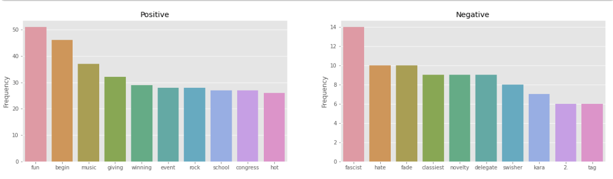

# Tweet Sentiment Towards Apple and Google

This analysis is looking to answer the following questions:
1) Can we classify tweets by their positive or negative sentiment?
2) Can we classify tweets by their positive, negative, or neutral sentiment?
3) What are the most important words in each category?

## Data Description
There are 9032 rows that include tweets, what the tweet is directed at, and the emotion of the tweet. The data can be found in the data.csv file.

## Data Cleaning
The following steps were taken to make the data useful:

**General Data**
- Dropped column 'emotion_in_tweet_is_directed_at' due to column being mostly incomplete. 
- Removed the only NaN value in tweet_text.
- Removed 'I can't tell' category.
- Renamed column 'tweet_text' to tweet and 'is_there_an_emotion_directed_at_a_brand_or_product' to 'emotion'
- Renamed categories in emotion from 'Positive emotion', 'Negative Emotion', and 'Neutral Emotion' to 'positive', 'negative', and 'neutral' in that order.

**Models**
- Removed stopwords.
- Removed punctuation.
- Removed words from each group that could be found in other groups. Only used in certain models.
- Lemmatize words.

## Data Exploration
Exploration began by looking at the top 10 tweets of the data set to get familiar with the data. First, we examined the 'I can't tell' category which consist of 156 rows. It was observed that some of these rows contain negative and positive tweets. Due to the size, they were left in the category they were assigned. Next, it was observed that the 'neutral' category had 5,000 points of data. This is substantially more than positive which came at around 3,000 points and negative which came at about 600 points. The following were characteristic found for positive, negative, and neutral tweets: [skip to visuals](#Characteristic-Figures)

**Positive**
- 6,692 unique words.
- SXSW, mention, link, ipad, rt, apple, google, store, iphone, and 2 were the most used words. 
- fun, begin, music, giving, winning, event, rock, school, congress, and hot were the most used words when words in common with the negative category were taken out. 
- andoid, madebymany, awesomely, pure, semantic, impressed, zomg, clever, deviantart, and installed were the most used words when words in common with the negative and neutral categories were taken out.

**Negative**
- 2,574 unique words.
- sxsw, mention, ipad, quot, iphone, google, rt, apple, and link were the most used words.
- fascist, hate, fade, classiest, novelty, delegate, swisher, kara, 2., and tag were the most used words when words in common with the positive category were taken out.
- terrible, socialviewing, batterykiller, brick, rji, tweetdeck, deleting, grrr, america., and write were the most used words when words in common with the positive and neutral categories were taken out.

**Neutral**
- 9,784 unique words.
- sxsw, mention, link, rt, google, apple, ipad, quot, store, iphone were the most used words.
- consider, social-type, 20+, 4:00-7:59:59p, zlf, 12:30pm, 12:00-3:59:59p, gearing, necro, and 03/12/11 were the most used words when words in common with positive and negative were taken out.

#### Characteristic Figures
**All Most Used Words**

**All Unique Words**

**Positive and Negative Unique Words**

## Modeling Sentiment
The initial goal was to create a binary model that could differentiate between positive sentiment and negative sentiment. positive and negative tweets were vectorize and split into a test and train set. The following algorithms were compared based on accuracy and F1 score.

- Logistic Regression
- K-Neighbors
- Decision Tree
- Random Forest
- AdaBoost
- Gradient Boost
- XGBoost Classifier
- SVC
- Naive Bayes

**Binary Model**
|Iteration|1|2|3|4|
|---|---|---|---|---|
|Accuracy|.87|.88|.88|.89|
|F1 Score|.96|.93|.93|.87|
|Model|SVC|Random Forest|SVC (All Data)|Tuned Random Forest|

#### Iterations
1) Plain vanilla algorithms and data were tested.
2) Common words were removed.
3) Unique words binary dataset and full binary dataset were resample using SMOTE.
4) Grid Search was performed, and the algorithm was tuned to the results. 

**Ternary Model**
|Iteration|1|2|3|4|
|---|---|---|---|---|
|Accuracy|.69|.67|.69|.69|
|F1 Score (macro)|.50|.51|.54|.54|
|Model|SVC|Random Forest|SVC (All Data)|Tuned SVC|

#### Iterations
1) Plain vanilla algorithms and data were tested.
2) Common words were removed.
3) Unique words binary dataset and full binary dataset were resample using SMOTE.
4) Grid Search was performed, and the algorithm was tuned to the results. 

## Conclusion
When looking at the most common words overall, it is hard to tell if there are important words. In the binary analysis, when common words were removed, it was apparent that they have unique words that are important. For example, positive tweets had positive words such as fun, giving, and winning. Negative tweets had negative words such as fascist, hate, and fade. When the same process was performed in the ternary model, the results were similar. However, the neutral category had certain words that made little sense such as necro.

The binary model performed well when using Random Forest to classify positive and negative tweets. When compared to the binary model, the ternary model did not perform as well. However, the best performing algorithm was Support Vector Classifier. However, when both models were examined with confusion matrices, it was observed that the models were biased to the dominant category. Dominant in this case means, that it has more data than the other categories. In the binary model, positive tweets overwhelmed the model. In the ternary model, neutral tweets overwhelmed the model. We are confident that with more balanced data, models can perform better when presented with test data. However, with the current data, models are not expected to perform well.

To better improve this project, more data needs to be gathered. In order to reduce human biased to what a positive/negative/neutral tweet is, it would be recommended to compare the likeliness of each tweet pertaining to each category. Furthermore, comparing companies in similar spaces in the market would perhaps improve the analysis. For example, using Apple and Samsung. 
